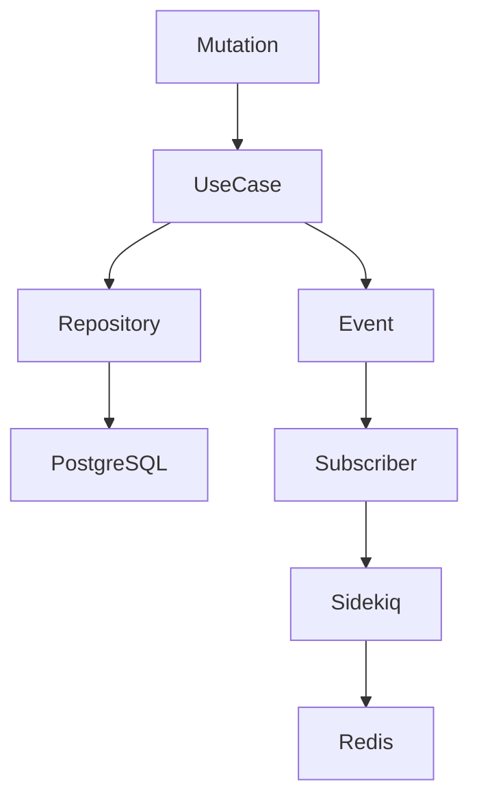

# ProjectFlow
[WIP] A production-ready project management platform built with Ruby on Rails 8, GraphQL and React. [WIP]

Designed using Modular Monolith Architecture, Vertical Slice and Lightweight DDD.

Release 0.0.1 (Only basic API with GraphQL, Sidekiq, Redis, Event Bus)
## Architecture

* Modular Monolith
* DDD
* Vertical Slice
* Repository Pattern
* Use Cases
* DTOs
* Domain Services
* Event-driven 
* GraphQL
* Sidekiq
* Redis

### Folder Structure
```
Application
    DTO
    UseCases
    Events

Domain
    Services
    Repositories

Infrastructure
    Subscribers

GraphQL
    mutations
    types
```
## Tech Stack

| Backend | Frontend   | Infra          |
| ------- | ---------- | -------------- |
| Rails 8 | React      | Docker         |
| GraphQL | TypeScript | PostgreSQL     |
| JWT     | Vite       | Redis          |
| Sidekiq |            | GitHub Actions |

# Sequence Diagram

# How task move works
```
       Mutation
          ↓
   MoveTaskUseCase
          ↓
   PositionManager
          ↓
      Repository
          ↓
   Optimistic Lock
          ↓
     Transaction
          ↓
   TaskMoved Event
          ↓
     Subscriber
          ↓
      Sidekiq
          ↓
       Redis
```

# Getting Started
We have a file called MakeFile on the root of project you can exec:

 >  make up_build

## Requirements
   Docker

# Running Tests
 > make test

# GraphQL API
If you want to know the mutations and queries please check this file in the root directory.
```
  mutations-and-queries.md
```
# Sequence Diagrams
[WIP]
# Future Improvements
[WIP]
